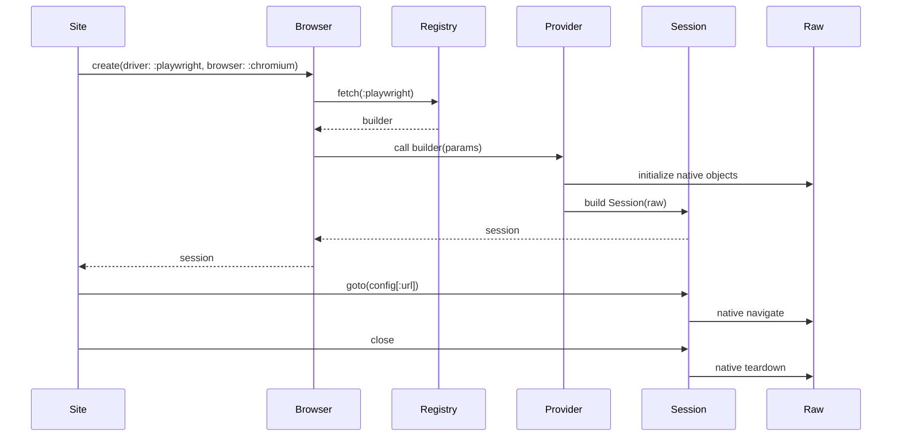

# Browsers and Adapters in Taza

This document explains how Taza integrates with browser automation tools using a small, pluggable adapter architecture.

TL;DR (quick start)
- Choose a driver and add its gem (watir, selenium-webdriver, or playwright-ruby-client).
- Optionally require the adapter file (only needed for optional providers like Playwright):
  - require 'taza/drivers/playwright'
- Configure config/config.yml:

```yaml
# config/config.yml
url: https://example.org
browser: chrome
driver: selenium_webdriver  # watir | selenium_webdriver | playwright
headless: true              # optional
```

- Use your Site as usual; Taza will create a session and navigate to the configured URL.

Architecture overview
- Registry-based providers: Taza::Browser.register(:name) installs a builder that knows how to create a session for that tool.
- Session wrapper: Taza::Browser::Session encapsulates the native driver and exposes a tiny, stable surface:
  - goto(url)
  - close
  - forwards unknown methods to the underlying raw driver to preserve compatibility
- Autoload: Browser.create will try to require a matching provider via 'taza/drivers/<driver>' if it isn’t registered yet.

Plugin discovery (optional)
- You can instruct Taza to auto-load all installed adapter plugins that expose adapter files under 'taza/drivers/*.rb'.
- Enable with an environment variable before your tests start:
  - TAZA_AUTOLOAD_DRIVERS=1
- When enabled, Taza will scan installed gems (Gem.find_files) and require each 'taza/drivers/*.rb' it finds once per process. Failures are ignored; unknown drivers still raise clear errors.
- Explicit requires continue to work and are preferred when you want a minimal footprint.

Mermaid: high-level flow
```mermaid
flowchart TB
  A[Taza::Site.new] -->|calls| B[Browser.create(params)]
  B --> C{DriverRegistry}
  C -->|lookup :driver| D[Provider Builder]
  D -->|returns| E[Browser::Session]
  E -->|forward| F[Raw Driver]
  A -->|uses| E
  E -->|goto(url)| F
  E -->|close| F
```

Mermaid: creation and navigation


Built-in providers
- watir (requires gem 'watir')
  - Browser.create(driver: :watir, browser: :firefox)
  - Session.goto -> Watir::Browser#goto, close -> #close
- selenium_webdriver (requires gem 'selenium-webdriver')
  - Browser.create(driver: :selenium_webdriver, browser: :chrome)
  - Session.goto -> driver.navigate.to, close -> driver.quit
- playwright (requires gem 'playwright-ruby-client')
  - require 'taza/drivers/playwright' to enable (or turn on plugin discovery)
  - Browser.create(driver: :playwright, browser: :chromium|:firefox|:webkit)
  - Session.goto -> page.goto, close -> context.close, browser.close, playwright.stop

Configuration keys
- driver: Symbol/String, one of the providers
- browser: Symbol/String (varies by provider)
- url: String, starting URL
- headless: Boolean (provider-specific; defaults sensible per adapter)
- extra: Hash, passed through to providers if you need custom options

Events
- Taza::Browser::Session publishes:
  - :before_navigate, payload: { session:, url: }
  - :after_navigate, payload: { session:, url: }
  - :session_closed, payload: { session: }
- Adapter event bridging (optional, when supported by the tool):
  - :console, payload: { session:, message }
  - :dialog_open, payload: { session:, dialog }
  - :request, payload: { session:, request }
  - :response, payload: { session:, response }
- Subscribe with Taza::Events.subscribe(:event) { |payload| ... }

Example
```ruby
sub = Taza::Events.subscribe(:console) { |p| puts "[console] #{p[:message].to_s}" }
# ... run steps ...
Taza::Events.unsubscribe(:console, sub)
```

Accessing the native driver
- Session forwards unknown methods to the underlying native object, so existing code continues to work.
- You can access session.raw for direct control; prefer staying within the minimal API when possible.

Legacy support
- A legacy Selenium RC path (create_selenium) remains for backward compatibility only. Prefer modern drivers. The call now emits a deprecation warning.

Troubleshooting
- Unknown driver: ensure you required the provider file or installed the gem; driver name must match registration.
- Load errors: adapters require their gems internally; add the dependency to your Gemfile.
- Headless modes: not all drivers support headless on all platforms; check your tool’s docs.

Contributing new adapters
- See ADDING_AN_ADAPTER.md for a step-by-step guide and a skeleton adapter.

## Error normalization
- Taza wraps navigation and close operations and re-raises common native exceptions as Taza::Errors:
  - TimeoutError: native class/message indicates timeout
  - ElementNotFound: native class/message indicates “no such element”/unknown object
  - StaleElement: native class/message indicates stale element
  - DialogError: native class/message indicates alert/dialog issues
  - NavigationError: default fallback for other failures during goto/close
- Explicit mappings when tool gems are loaded:
  - Selenium: NoSuchElementError → ElementNotFound; StaleElementReferenceError → StaleElement; UnhandledAlertError → DialogError; TimeoutError → TimeoutError
  - Watir: UnknownObjectException → ElementNotFound; Watir::Wait::TimeoutError → TimeoutError
- Adapters should avoid catching/swallowing native exceptions for these operations so they can be normalized by the Session wrapper.

Rescue patterns
- Catch normalized errors in your specs or flows consistently:

```ruby
# Example: rescue specific navigation timeouts
begin
  site = MySite.new(url: 'https://example.org')
  # interactions that may navigate
rescue Taza::Errors::TimeoutError => e
  warn "Navigation timed out: #{e.message}"
end

# Example: asserting an element is missing
expect {
  site.some_page.missing_button.click
}.to raise_error(Taza::Errors::ElementNotFound)
```

## Unified Element API (optional)
- You can declare page elements using driver-agnostic locators. Taza wraps the native element with a small, consistent API while forwarding unknown calls.
- Usage in a page class:

```ruby
class HomePage < Taza::Page
  element(:search_input, css: '#search')
  element(:submit_button, xpath: "//button[@type='submit']")
end

home = HomePage.new
home.browser = my_session   # Taza::Browser::Session
home.search_input.fill('hello')
home.submit_button.click
```

- Supported locators: css, xpath, id, name, link_text (mapping per driver)
  - Watir: raw.element(**locator)
  - Selenium: raw.find_element(by, value)
  - Playwright: raw.locator(selector) (falls back to query_selector)
- Wrapper methods provided by Taza::Elements::Element:
  - click, text, visible?/present?, fill/set, exist?, wait_for_visible(timeout:, interval:)
  - Unknown methods forward to the underlying native element for maximum compatibility.
- You can still define elements using blocks for full control:

```ruby
element(:avatar) { browser.img(id: 'avatar') }
```
